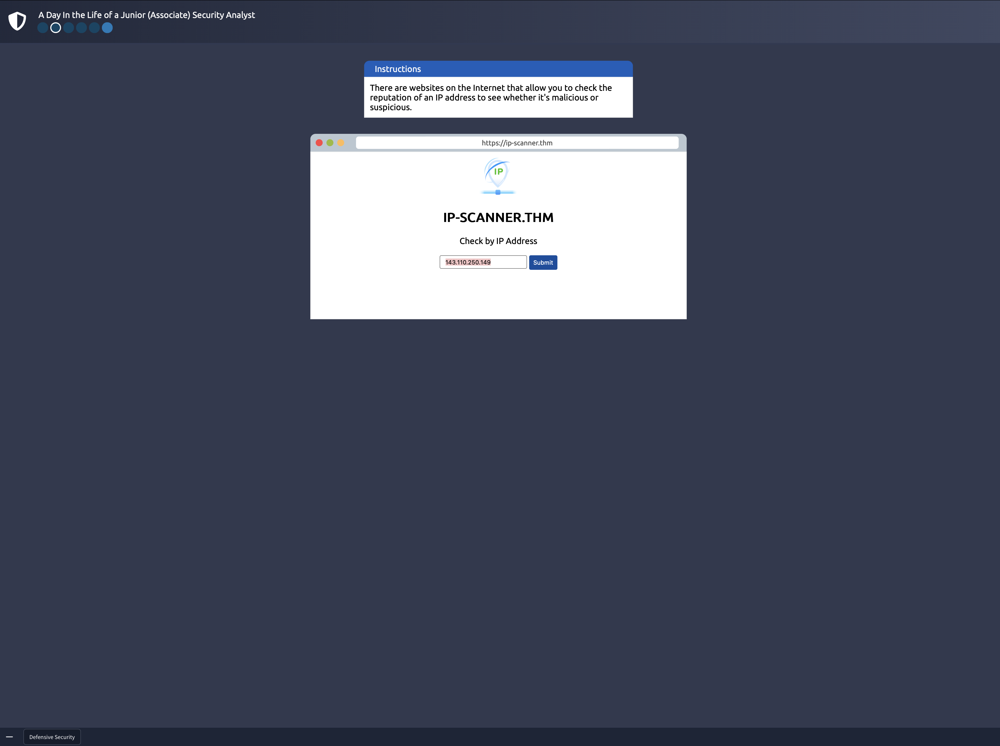
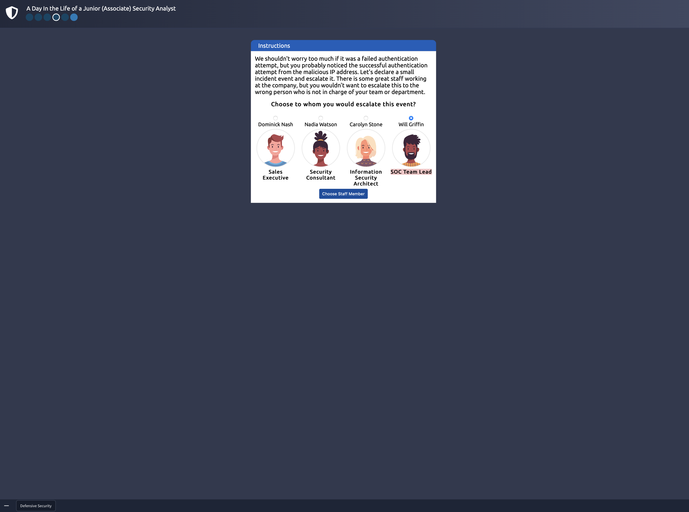

# TryHackMe – Defensive Security Intro

## Descrizione
Room su TryHackMe che simula un tentativo di accesso non autorizzato.  
Obiettivo: identificare una minaccia in un ambiente di monitoraggio (SIEM) e rispondere con le misure difensive appropriate.

## Obiettivi completati
- [x] Rilevamento di attività sospette tramite alert nel SIEM
- [x] Analisi di un indirizzo IP tramite piattaforma di threat intelligence
- [x] Notifica al personale competente per la gestione dell’incidente
- [x] Aggiornamento della regola firewall per bloccare l’IP malevolo

## Strumenti utilizzati
- SIEM (strumento generico)
- Piattaforma di analisi IP (es. VirusTotal o simili)
- Console firewall simulata

## Note personali
> Prima esposizione a strumenti difensivi fondamentali nella cybersecurity.  
Ho compreso i concetti base di rilevamento, triage e risposta a un attacco reale, anche se in ambiente semplificato.  
L'esercizio mi ha dato un'idea chiara del flusso operativo tipico di un Security Operation Center (SOC)

## Screenshot

### 1. SIEM Alert  
Rilevamento di attività sospetta tramite il sistema SIEM.

---

### 2. IP Scanner  
Avvio dello scanner IP per analizzare l’origine del traffico sospetto.

---

### 3. IP Scanner Result  
Risultato dell’analisi IP tramite strumento integrato.

---

### 4. Advise  
Comunicazione dell’incidente al team di sicurezza incaricato della gestione.  
Dimostra la fase di escalation all'interno del flusso SOC.

---

### 5. Firewall Block  
Blocco dell’indirizzo IP identificato come malevolo tramite il pannello firewall.

